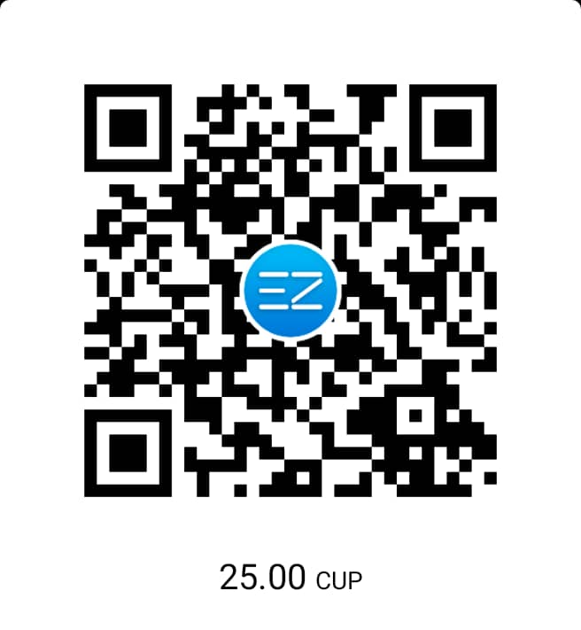

# Microservice shadowsocks server 

[](https://github.com/linux8a/docker_shadowsocks/actions/workflows/docker-image.yml)

create for Argenis Ochoa Gonzalez (@linux8a)

use

* copy emviromment

```
copy env.examples .env
```

* Run generate-password

```
./generate-password.sh
```
* Run microservice


* Edit .env add your IP external (ip public)


* Run 

```
docker-compose up -d
``` 

* View code qr for import scan

```
docker-compose logs shadowsocks
```


:-)


* Donacion:



o un usd en bitcoin

